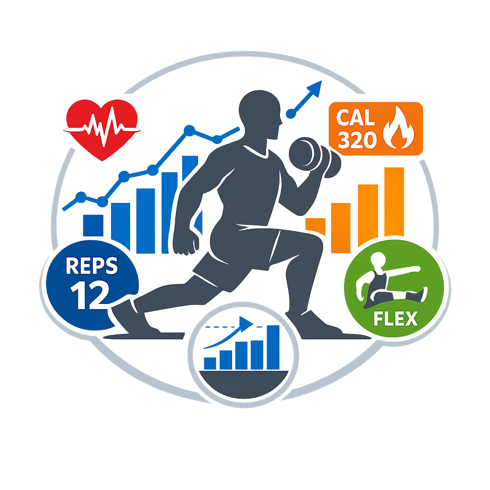

<h2 align="center">Functional Exercise Impact on Weight Training</h2>
<h2 align="center">A Data Analytics Project by Gary Dahnke</h2>

  

Project Overview
----------------
This project analyzes the impact of functional exercises, mobility work, tendon strengthening, and cardio on my weight training performance, 
recovery, and overall physical health.

The purpose of this project is to use structured data collection and analysis to answer a central question:
How do functional/mobility exercises influence strength performance, recovery, soreness, and nervous system readiness in a long-term lifter?

Motivation
----------
After decades of weight training, I noticed gaps in:  
-mobility  
-tendon resilience  
-joint comfort  
-recovery speed of weight training to muscle groups and central nervous system  

To address this, I incorporated:  
1. Mobility exercises:   
	-Pull Ups  
	-Controlled Articular Rotations for shoulders, wrists, hips, knees, ankles  
2. Tendon strengthening protocols:  
	-Deep Squat Hold  
	-Goblet Squat Hold  
3. Cardio:  
	-Hip Elliptical  
	-Reverse Walking  
	-Side Walking  

This project tracks how these additions affect:  
-Soreness  
-Strength Output  
-Joint Comfort  
-Mobility  
-Recovery  
-Daily Health Markers  

Weight Training Methodology
---------------------------
Weight train each muscle group once per week and follow a low volume, high intensity strategy. Limit each exercise to 2 sets from 5 to 12 repetitions 
pushing to 0 to 1 repetitions of failure.

This creates a consistent baseline for evaluating:  
-Strength Progression  
-Recovery Patterns  
-Mobility Improvements  
-Tendon Resilience  

Data Collection Structure
-------------------------
The data will be collected and stored in a spreadsheet consisting of 5 sheets. Three of these sheets contain the data collected. The remain two sheets
contains deatils about exercises and sheets.
Workouts - This sheet is used to log all weight training, CAR/Mobility, and tendon strengthening exercises.
Daily Health Log - This sheet is used to track daily personal health markers including objective statistics and subjective measurements based on personal judgment.
Assessments - This sheet contains activities, exercise, and other objective statistic that will be taken weekly or monthly to track progress to evaluate the impact of functional exercises on my health and weight training.
Protein Consumption - This sheet contains data about the food consumed that contains protein, how much protein in grams, 
Exercises - This sheet contains a list of exerices and associated information.
Column Index - This sheet contains a definition of each column name and the sheet the column is used.
Note that columns may be added or removed from any sheet to improve the process of collecting data for analysis.

Planned Analysis
----------------
1. Performance Trends  
	-Strength progression  
	-Rep/weight consistency  
	-PR frequency  
2. Recovery Metrics  
	-Soreness reduction  
	-Joint comfort	  
	-Nervous system readiness  
	-Sleep correlation  
3. Mobility & Tendon Impact  
	-CAR frequency vs mobility scores  
	-Tendon work vs joint stability  
	-Reverse walking vs knee comfort  
4. Cardio Influence  
	-Energy levels  
	-Recovery speed  
	-Weight fluctuations  
5. Holistic Health  
	-Mood trends  
	-Stress markers  
	-Daily health correlations  
	
How to Rate Flexibility Without Guessing - Use reliable subjective measure. 
1. Use CAR movements - CARs expose:  
	-end-range control  
	-stiffness  
	-smoothness  
	-joint clicking  
	-discomfort  
2. Use “end-range feel” - Ask yourself:
	-Does the joint feel blocked?  
	-Does it glide smoothly?  
	-Does it feel tight at the end?  
3. Use movement quality - Rate:
	-smoothness  
	-control  
	-stability  
	-ease	
	

Tools & Skills Demonstrated
---------------------------
-Python  
-Pandas  
-Matplotlib/Seaborn  
-Time-series analysis  
-Health and performance analytics  

Repository Structure  
--------------------
│  
├── data/  
│ ├── fitness-log.odp  
│ └── archive/  
│  
├── notebooks/  
│ ├── *.*  
│ └── *.*  
│  
├── visualizations/  
│ ├── charts/  
│ │ ├── *.*  
│ │ └──	*.*	  
│ │  
│ └── plots/  
│   ├── *.*  
│   └── *.* 
│
├── readme-appendices/
│   ├── *.*  
│   └── *.* 
│
└── README.md

Exercises
---------
[Exercises](/readme-appendices/readme-exercises.md)  

Data Dictionary
---------------
[Data Dictionary](/readme-appendices/readme-data-dictionary.md)
